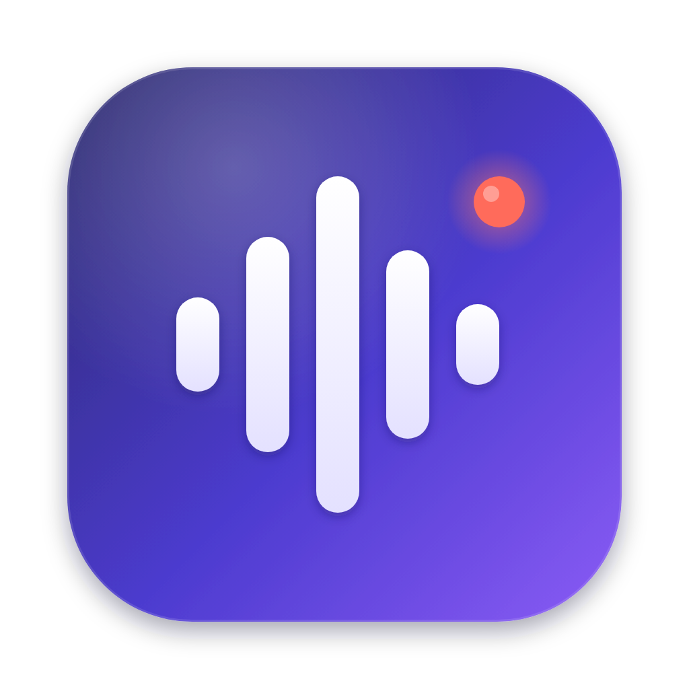

# Kiku（キク）




Zoom / Google Meet の会議が始まると自動で録音を開始し、会議が終わると自動で停止・保存するデスクトップアプリです。
PLAUD Desktop と同じ使い方ができますが、**録音時間に上限はありません**（ディスクの空き容量だけが上限です）。

## 主な機能

| 機能 | 内容 |
| --- | --- |
| Zoom自動検知 | 3秒ごとにZoomの状態を確認して、会議の開始と終了を検知します（Windows: 会議中だけ動く `CptHost` プロセス、Mac: Zoomの通信の数） |
| Google Meet自動検知 | 会議に参加したら録音を開始し、「ミーティングから退出しました」の画面になったら停止します（ブラウザの「Apple Events からの JavaScript を許可」がオフのときは、会議のページを開いたら開始し、そのタブを閉じたら停止します）。Mac: Chrome / Safari / Edge / Brave / Arc。Windows: Chrome / Edge / Brave（Meetのタブが前面にあるときだけ） |
| 自動録音 | 会議開始で録音を始め、会議終了で停止・保存します（設定でオフにできます） |
| 録音する会議の指定 | 「すべての会議」か「登録した会議だけ」を選べます。定例会議などのリンク（Zoom / Google Meet）や Zoom の招待文を貼り付けて登録すると、その会議のときだけ自動で録音し、録音に会議名が付きます。登録していない会議が始まったときは通知が出て、クリックすると録音できます |
| 相手の声 + 自分の声 | PCの音声（相手の声）とマイク（自分の声）を1つのファイルにまとめて録音します |
| マイクの自動選択 | Zoom / Google Meet で選んでいるマイクを自動で使って、自分の声を録音します。会議中にマイクを切り替えると、録音も切り替わります（Mac のみ。設定で特定のマイクに固定することもできます） |
| 時間無制限 | 5秒ごとにディスクへ追記するので、何時間録っても大丈夫です。アプリが落ちても直前までの音声は残ります |
| 常駐 | ウィンドウを閉じてもタスクトレイ（メニューバー）で待機し続けます |
| 自動起動 | PC起動時にアプリを立ち上げる設定ができます |
| 録音一覧 | アプリ内で再生、保存場所の表示、削除ができます |
| MP3でダウンロード | 録音一覧のボタンを押すと、MP3（128kbps・モノラル）に変換して「ダウンロード」フォルダに保存します。長い録音も少しずつ変換するので、何時間分でも大丈夫です（1時間の録音でおよそ1〜3分） |

録音は `書類/Kiku Recordings/`（以前のバージョンから使っている場合は `書類/ASAP Recordings/` のまま） に `2026-10-06_14-00-00.webm`（Opus形式、128kbps、約58MB/時間）として保存されます。
同じ名前の `.json` ファイルには、開始時刻、終了時刻、長さが記録されます。

## 使い方（開発環境）

[Node.js](https://nodejs.org/)（v20以上）をインストールしてから、以下を実行します。

```bash
cd desktop-recorder
npm install
npm run build:native   # Mac のみ。マイク自動選択に使う小さなプログラムを作ります（Xcode が必要）
npm start
```

## インストーラーの作成

```bash
npm run dist:mac   # macOS 用 .dmg
npm run dist:win   # Windows 用 .exe
```

## 動作条件と初回設定

- **Windows 10/11**: 追加の設定はいりません。
- **macOS 13 以降**: 初回の録音時に次の2つの許可を求められます。
  - 「システム設定 → プライバシーとセキュリティ → **画面収録とシステムオーディオ録音**」でアプリを許可（相手の声を録るために必要です）
  - 「**マイク**」を許可（自分の声を録るために必要です）
  - Google Meetを使うときは「Kiku が "Google Chrome" を制御しようとしています」と出るので「**OK**」を押す（会議のタブを見つけるために必要です。あとからは「プライバシーとセキュリティ → **オートメーション**」で変更できます）
  - Google Meetで会議を退出したらすぐに録音を止めたいときは、Chromeのメニュー「**表示 → 開発 / 管理 → Apple Events からの JavaScript を許可**」をオンにする（Safariは「開発」メニューの同じ項目）。Kiku はこれを使って、Meetのページが「会議中」か「退出後」かだけを確認します
  - 許可したあとはアプリを再起動してください。

## 録音されないとき

アプリの「録音一覧」の「**ログを開く**」を押すと、何が起きたかの記録を見られます。

| 症状 | 原因と対処 |
| --- | --- |
| Zoom会議中なのに右上が「Zoom: 未検出」のまま | 自動検知が効いていません。「録音を開始」ボタンで手動で録音できます。ログの内容を開発者に送ってください |
| 赤い文字で「PCの音声を取得できませんでした」と出る | 「画面収録とシステムオーディオ録音」の許可がありません。`npm start` で起動した場合は「ターミナル」（または「Electron」）を許可し、ターミナルを ⌘Q で終了してから起動し直してください |
| Google Meetで会議中なのに「会議: 未検出」のまま | 「プライバシーとセキュリティ → オートメーション」で、Kiku の下の「Google Chrome」をオンにしてください |
| Google Meetの会議を抜けたのに録音が止まらない | Chromeの「表示 → 開発 / 管理 → **Apple Events からの JavaScript を許可**」をオンにしてください。オフのままだと、**Meetのタブを閉じる**まで録音が続きます |
| 自分の声の音質が悪い | 録音中に画面に出る「録音中のマイク」が、Zoom / Meet で使っているマイクと同じか確認してください。違う場合は、設定の「録音に使うマイク」でそのマイクを選んで固定できます |
| 「登録した会議だけ」にしたら、登録したZoom会議が録音されない | Zoom は、リンクをクリックしたときにブラウザで開く「zoom.us/j/会議ID」のページで会議を見分けます。Zoomアプリの予定一覧やカレンダーアプリから直接参加すると見分けられないので、登録した会議にはブラウザでリンクを開いて参加してください（そのときも通知をクリックすれば録音できます） |
| 赤い文字で「マイクを取得できませんでした」と出る | 「マイク」で同じように許可してください |

## 注意

- 録音する前に、会議の参加者に録音することを伝えてください。
- `.webm` はブラウザ、VLC、文字起こしサービス（Whisper など）でそのまま使えます。MP3 が必要なときは、録音一覧の「MP3でダウンロード」を使ってください。
- MP3 への変換には [lamejs](https://github.com/zhuker/lamejs)（[LAME](https://lame.sourceforge.io) の JavaScript 版、LGPL-3.0）を使っています（`src/renderer/vendor/`）。

## 今後追加できる機能

- 録音が終わったら自動で文字起こしと要約をする（Whisper / Claude API など）
- Microsoft Teams の自動検知
- 録音ファイルをクラウドに自動アップロード
